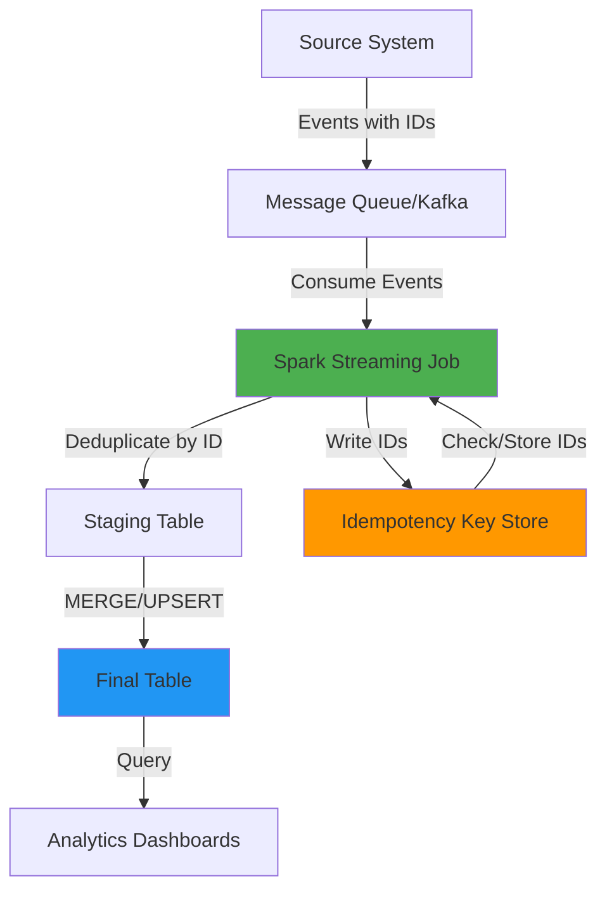

## The Hook: When Duplicates Cost You Everything

You've just deployed your new Spark job to production. It processes 50 million events daily, transforming raw clickstream data into a clean analytics table. Everything looks good in staging. Then, on day three, your analytics team reports a critical issue: **revenue metrics are inflated by 23%**.

After hours of debugging, you discover the culprit: a network hiccup caused your job to retry, and now you have duplicate transactions in your final table. Your downstream dashboards are broken, and your CEO is asking why the numbers don't match the finance team's reports.

This isn't just a data quality issue—it's a **trust issue**. In distributed systems, failures are inevitable. Network partitions, worker crashes, and retry mechanisms all conspire to create duplicate data. If you don't handle this proactively, you'll spend more time firefighting than building.

## The Solution: Building Idempotent Data Pipelines

The answer is **idempotency**: designing your pipelines so that running them multiple times produces the same result as running them once. Here's how to implement it at scale.

### Architecture Overview



### Pattern 1: Deduplication in Spark

For batch processing, use Spark's built-in deduplication with a deterministic approach:

```python
from pyspark.sql import SparkSession
from pyspark.sql.functions import (
    col, 
    row_number, 
    window, 
    max as spark_max
)
from pyspark.sql.window import Window

def deduplicate_events(df, id_column, timestamp_column, partition_columns=None):
    """
    Deduplicate events by keeping the latest record per ID.
    
    Args:
        df: Input Spark DataFrame
        id_column: Column name containing unique event ID
        timestamp_column: Column name for event timestamp
        partition_columns: Optional list of columns to partition by
        
    Returns:
        Deduplicated DataFrame
    """
    if partition_columns:
        partition_spec = partition_columns + [id_column]
    else:
        partition_spec = [id_column]
    
    window_spec = Window.partitionBy(partition_spec).orderBy(
        col(timestamp_column).desc()
    )
    
    return (
        df.withColumn("_row_num", row_number().over(window_spec))
        .filter(col("_row_num") == 1)
        .drop("_row_num")
    )

# Usage example
spark = SparkSession.builder.appName("Deduplication").getOrCreate()

raw_events = spark.read.parquet("s3://bucket/raw-events/")
deduplicated = deduplicate_events(
    raw_events,
    id_column="event_id",
    timestamp_column="event_timestamp",
    partition_columns=["date"]
)

deduplicated.write.mode("overwrite").parquet("s3://bucket/deduplicated-events/")
```

### Pattern 2: Idempotent Writes with Snowflake MERGE

For data warehouses, use `MERGE` statements to ensure idempotent writes:

```sql
-- Snowflake MERGE pattern for idempotent upserts
MERGE INTO analytics.transactions AS target
USING (
    SELECT DISTINCT
        transaction_id,
        user_id,
        amount,
        transaction_timestamp,
        -- Deterministic hash for change detection
        HASH(transaction_id, user_id, amount, transaction_timestamp) AS record_hash
    FROM staging.transactions_staging
    QUALIFY ROW_NUMBER() OVER (
        PARTITION BY transaction_id 
        ORDER BY transaction_timestamp DESC
    ) = 1
) AS source
ON target.transaction_id = source.transaction_id
WHEN MATCHED AND target.record_hash != source.record_hash THEN
    UPDATE SET
        user_id = source.user_id,
        amount = source.amount,
        transaction_timestamp = source.transaction_timestamp,
        record_hash = source.record_hash,
        updated_at = CURRENT_TIMESTAMP()
WHEN NOT MATCHED THEN
    INSERT (
        transaction_id,
        user_id,
        amount,
        transaction_timestamp,
        record_hash,
        created_at
    )
    VALUES (
        source.transaction_id,
        source.user_id,
        source.amount,
        source.transaction_timestamp,
        source.record_hash,
        CURRENT_TIMESTAMP()
    );
```

### Pattern 3: Distributed Idempotency Keys

For streaming pipelines, maintain a distributed key store to track processed IDs:

```python
from pyspark.sql import SparkSession
from pyspark.sql.functions import col, broadcast
import redis

class IdempotencyChecker:
    """Check and record processed event IDs using Redis."""
    
    def __init__(self, redis_host, redis_port=6379):
        self.redis_client = redis.Redis(
            host=redis_host, 
            port=redis_port, 
            decode_responses=True
        )
        self.key_prefix = "processed:"
        self.ttl_seconds = 86400 * 7  # 7 days
    
    def is_processed(self, event_id: str) -> bool:
        """Check if event has been processed."""
        key = f"{self.key_prefix}{event_id}"
        return self.redis_client.exists(key) > 0
    
    def mark_processed(self, event_id: str):
        """Mark event as processed."""
        key = f"{self.key_prefix}{event_id}"
        self.redis_client.setex(key, self.ttl_seconds, "1")
    
    def filter_unprocessed(self, df, id_column="event_id"):
        """Filter DataFrame to only unprocessed events."""
        # For production, use broadcast join with processed IDs
        # This is a simplified version
        processed_ids = set()
        for row in df.select(id_column).distinct().collect():
            event_id = row[id_column]
            if not self.is_processed(event_id):
                processed_ids.add(event_id)
                self.mark_processed(event_id)
        
        return df.filter(col(id_column).isin(processed_ids))

# Usage in streaming job
spark = SparkSession.builder.appName("IdempotentStreaming").getOrCreate()

checker = IdempotencyChecker(redis_host="redis-cluster.internal")

stream_df = spark.readStream.format("kafka") \
    .option("kafka.bootstrap.servers", "kafka:9092") \
    .option("subscribe", "events") \
    .load()

# Parse and deduplicate
events = parse_kafka_messages(stream_df)
unique_events = checker.filter_unprocessed(events)

# Write to destination
query = unique_events.writeStream \
    .format("parquet") \
    .option("path", "s3://bucket/processed-events/") \
    .option("checkpointLocation", "s3://bucket/checkpoints/") \
    .start()
```

### Pattern 4: Deterministic Partitioning

Ensure your partitioning strategy supports idempotency:

```python
def write_idempotent(df, output_path, partition_columns, id_column):
    """
    Write data with deterministic partitioning for idempotent overwrites.
    """
    # Partition by date and hash of ID for even distribution
    df_with_partition = df.withColumn(
        "partition_hash",
        hash(col(id_column)) % 100  # 100 partitions
    ).withColumn(
        "date",
        to_date(col("timestamp"))
    )
    
    # Write with overwrite mode - safe because partition is deterministic
    df_with_partition.write \
        .mode("overwrite") \
        .partitionBy(["date", "partition_hash"]) \
        .parquet(output_path)
```

## The "Why": Why This Approach Works

I've seen teams try three common alternatives, and here's why they fall short:

**Option 1: "Just use DISTINCT"**  
This works for small datasets but breaks at scale. `DISTINCT` requires a full shuffle, which is expensive and doesn't handle late-arriving duplicates from retries.

**Option 2: "Track processed IDs in a database"**  
This creates a bottleneck. Every event requires a database lookup, which doesn't scale beyond thousands of events per second.

**Option 3: "Ignore duplicates downstream"**  
This pushes the problem to analysts who write `GROUP BY` queries everywhere. It's a band-aid, not a solution.

**Why my approach works:**

1. **Window functions are efficient**: They partition data locally on workers, avoiding expensive shuffles for most cases.
2. **MERGE statements are atomic**: Snowflake's `MERGE` ensures consistency even with concurrent writes.
3. **Distributed key stores scale**: Redis clusters can handle millions of lookups per second with sub-millisecond latency.
4. **Deterministic partitioning enables safe overwrites**: You can rerun jobs without fear of corrupting data.

The key insight: **idempotency isn't just about deduplication—it's about making your entire pipeline rerunnable**. This is what separates production-grade pipelines from prototypes.

## The Trade-offs: What You're Giving Up

No solution is perfect. Here's what you need to accept:

**Storage Overhead**: Maintaining idempotency keys requires storage. For a 50M event/day pipeline, that's ~350M keys in Redis (with 7-day TTL). At ~100 bytes per key, that's ~35GB. Manageable, but not free.

**Latency Impact**: Checking Redis adds ~1-2ms per event. For high-throughput streams (100K+ events/sec), this can become a bottleneck. Consider batching checks or using in-memory Bloom filters as a first pass.

**Complexity**: You're adding moving parts. Redis can fail, window functions can have edge cases with skewed data, and MERGE statements can deadlock under high concurrency. You need monitoring and alerting.

**Event Ordering**: If you deduplicate by keeping the "latest" event, you're making assumptions about event ordering. In distributed systems, events can arrive out of order. You might need to implement a more sophisticated conflict resolution strategy.

**Cost**: Snowflake MERGE operations consume compute credits. For large tables, this can be expensive. Consider batching MERGEs or using Snowflake's `COPY INTO` with `MATCH_BY_COLUMN_NAME` for append-only patterns.

The bottom line: **Idempotency adds complexity, but the alternative—unreliable data—is worse**. The trick is implementing it efficiently and monitoring it closely.

## Conclusion

Duplicate data in distributed systems isn't a bug—it's a feature of how these systems handle failures. Your job as a data engineer is to design pipelines that are resilient to these failures.

The patterns I've shown here—window-based deduplication, MERGE statements, distributed idempotency keys, and deterministic partitioning—are battle-tested approaches that scale. They're not the only way to solve this problem, but they're the ones I've seen work reliably in production at scale.

Start with the simplest pattern that fits your use case. If you're doing batch processing, use window functions. If you're writing to a data warehouse, use MERGE. If you're building a streaming pipeline, add an idempotency key store. Then measure, monitor, and iterate.

Your future self (and your analytics team) will thank you.

---

**Further Reading:**
- [Apache Spark Window Functions Documentation](https://spark.apache.org/docs/latest/sql-ref-syntax-qry-select-window.html)
- [Snowflake MERGE Best Practices](https://docs.snowflake.com/en/sql-reference/sql/merge.html)
- [Exactly-Once Semantics in Kafka](https://kafka.apache.org/documentation/#semantics)

